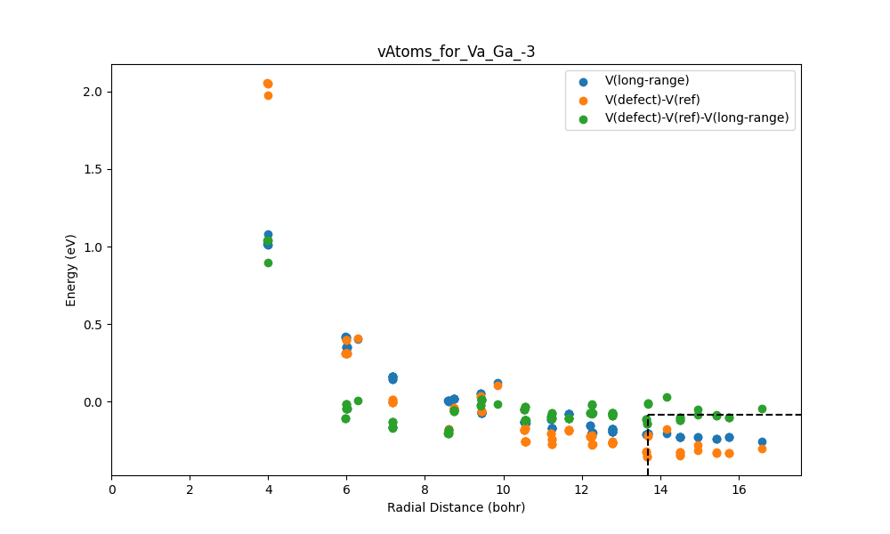
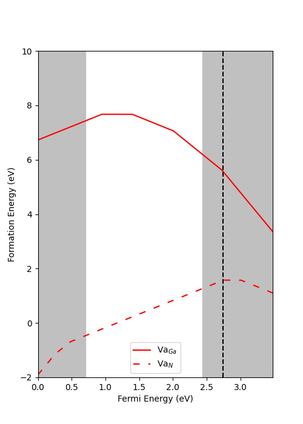

# Tutorial of Behrend Defect Analyzer (BDA)

This page explains how to use the `BDA` code.

To follow this tutorial, defect calculations should already have been performed using [PyDefect](https://github.com/kumagai-group/pydefect) or another method [1]. This workflow also builds on scripts developed by [Zachery Willard](https://github.com/zacherywillard) [2] and [Evan Payne](https://github.com/EvanPayne22) [3], which handle defect energy extraction and formatting for BDA. If further information on formatting is required, refer to their repositories. Once these calculations are complete, charged defect formation energy analysis can begin.

The BDA is a tool used to calculate formation energies using the quantum simulation package known as [VASP](https://www.vasp.at/) [4]. It also uses [`sxdefectalign`](https://sxrepo.mpie.de/attachments/download/73/sxdefectalign-manual.pdf) to compute correction terms for charged defects [5], including finite-size and long-range potential energy corrections. The tool can then plot formation energy as a function of fermi energy.  These plots help identify the stability of defects, defect charge, and the effects of doping (i.e., changes in fermi energy). The BDA helps to automate this process. 


The formation energy of a defect is calculated as:

$$
E_\text{form}= E_\text{tot}^\text{defect} - E_\text{tot}^\text{bulk} - \sum_i \Delta n_i \mu_i^{eff} + q(E_\text{vbm}+E_F+\Delta V) + E_\text{corr}
$$

Where:

- $E_\text{tot}^\text{defect}$ is the total energy of the defect supercell  
- $E_\text{tot}^\text{bulk}$ is the total energy of the pristine bulk  
- $n_i$ is the number of atoms added or removed  
- $\mu_i^{eff}$ is the chemical potential of species $i$, defined as: $\mu_i^{eff}=\mu_i^{bulk}+\Delta \mu_i$
	- $\mu_i^{\mathrm{bulk}}$ is the bulk reservoir energy per atom of species $i$
	- $\Delta \mu_i$ is the relative chemical potential of species $i$ (e.g., Ga-rich)
- $q$ is the defect charge  
- $E_F$ is the Fermi level  
- $E_\text{vbm}$ is the valence band maximum  
- $\Delta V$ is the potential alignment correction calculated by `sxdefectalign`  
- $E_\text{corr}$ is the finite-size and electrostatic correction obtained from `sxdefectalign`

This workflow assumes users know all values except the energy correction terms. For more details on formation energies and correction schemes in GaN, see Lyons and Van de Walle [6].

The BDA assumes the following directory structure:
- The placeholder `<project_name>` typically represents the name of the target material.

```
    <project_name>
     │
     ├ bulk_supercell/ ──
     │                 ├─ OUTCAR
     │                 ├─ LOCPOT
     │
     └ defects/ ── 
                ├─ POSCAR (Bulk)
                ├─ energies_final_vAtoms_plots.py
                ├─ formation_vs_fermi.py
                ├─ make_vAtoms_output.sh
                ├─ run_sxdefectalign.sh
                ├─ target_vertices_X_Rich.yaml
                ├─ target_vertices_Y_Rich.yaml
                ├─ Va_X_0/
                ├─ Va_X_1/
                ├─ Va_X_2/
                 ...
```
We recommend that users follow the same directory structure if possible. The defect directories must also follow the naming convention shown. 

The BDA also assumes the following formatting for POSCAR files. The header must include the defect center (i.e. three values representing the x,y,z coordinates of the defect in lattice units). The rest of the POSCAR should have the standard format, see for example: [Materials Project](https://next-gen.materialsproject.org/materials) [7] and below:

    ```
    0.083333 0.166666 0.499553 #defect center
    1.0
      12.8672158884    0.0000000000    0.0000000000
      -6.4336079442   11.1433358354    0.0000000000
       0.0000000000    0.0000000000   10.4781669866
    Ga N
    63 64
    direct
       0.0833333333    0.1666666667    0.9995534669 
       ...
    ```
   - Note: when using PyDefect, the defect center does not appear in the first line of the POSCAR file. To locate it, refer to the defect_entry.json file, where it is specified as \"defect_center\".
   
The plotting workflow requires a chemical potential input file (`target_vertices_<element>_Rich.yaml`) that defines the growth conditions used in the defect formation energy calculations (e.g., Ga-rich or N-rich). A detailed description of the file format and naming convention is provided in Step 2.

The rest of the details for the workflow are explained step by step, using GaN as an example, calculated with the PBE and HSE functional.
# Step 1. Energy Corrections ($E_{corr}$, $\Delta V$)

In charged-defect VASP calculations, the defect artificially interacts with its periodic images due to the finite size of the simulation. A correction is required to gain the isolated defect formation energy. Christopher Freysoldt created a program to compute this correction ($E_{corr}$). It also generates data to determine the shift in the long-range electrostatic potential ($\Delta V$). The `run_sxdefectalign` script uses Freysoldt's program called `sxdefectalign`, which must first be installed. 

**Download and setup**
Download at https://sxrepo.mpie.de/projects/sphinx-add-ons/files, then download sxdefectalign.bz2 and install with the following:
``` {.bash language="bash"}
bunzip2 sxdefectalign.bz2
chmod +x sxdefectalign
mv sxdefectalign ~/work/bin/
```
The `sxdefectalign` program is expected to be located in a directory named bin inside of your work directory. If the bin folder does not exist, create it and move the Freysoldt `sxdefectalign` inside. The path is hard coded in the `run_sxdefectalign` script and must be updated if Freysoldt's `sxdefectalign` is installed elsewhere. The `make_vAtoms_output` script is also required. It automatically searches all subdirectories in the working directory, reads the `vAtoms.dat` files created by `run_sxdefectalign`, formats the vAtom data as comma-seperated values, and then stores them in a file named `vAtoms_output.csv`. 


**Configuring the Scripts**
To use `run_sxdefectalign`, edits must first be made as described below.

-   Set the path to the bulk directory in line 13:

    ``` {.bash language="bash"}
    bulk="/path/to/BulkSupercell/"
    ```

-   Provide the dielectric tensor for your material in line 38:

    ``` {.bash language="bash"}
    --tensor 10.24,10.24,11.33
    ```

    Note: this should be the total dielectric tensor, both the electronic and ionic tensors added together. It follows Materials Project's convention. Use the Materials Project's values or perform the calculation yourself.

The `make_vAtoms_output` script will not require any modification. 

## Running the Scripts

First make the `run_sxdefectalign` executable in the terminal and run:

``` {.bash language="bash"}
chmod +x run_sxdefectalign.sh
./run_sxdefectalign.sh
```

During execution, the script prints the defect charge state, defect directory name, and the corresponding correction energy. An example output is shown below:
```
-0
Va_Ga_0/, -1072.37408904, 0
1
Va_Ga_-1/, -1069.98956324, 0.164549
-1
Va_Ga_1/, -1074.68454378, 0.164549
2
Va_Ga_-2/, -1067.30102614, 0.658195
...
```


Then make `make_vAtoms_output` executable and run:
```
chmod +x make_vAtoms_output.sh
./make_vAtoms_output.sh
```
 The script prints nothing by default but will populate vAtoms_output.csv.
  
## Outputs
`run_sxdefectalign` produces `energies_correction.csv` which contains: 
  
- Header row: Defect Name, Bulk Energy, Correction Energy ($E_{Corr}$)  

-  Data rows: directory name, bulk energy, correction energy for each defect

**Example snippet:**
``` {.bash language="bash"}
Defect Name, Bulk Energy, Correction Energy
bulk, -779.26382452, 0
Va_Ga_0/, -769.12439871, 0
Va_Ga_-1/, -766.05547513, 0.1844
Va_Ga_1/, -771.58783550, 0.1844
Va_Ga_-2/, -762.69860429, 0.737601
Va_Ga_-3/, -759.18076603, 1.6596
...
```
`make_vAtoms_output` produces `vAtoms_output.csv`, which contains:

-   Header row: Column 1, Column 2, Column 3, Column 4, Column 5, ...

-   Directory markers (stop,<directory_name>) before each defect’s data.
    
-   Comma-separated vAtoms data for each defect.
    
-   Final stop marker at the end.

**Example snippet:**
```
Column 1, Column 2, Column 3, Column 4, Column 5  
stop,Va_Ga_0/  
9.87797,0,-0.0813866,-0.0813866,-0.00228509
6.12053,0,-0.0238853,-0.0238853,-3.09364
...
stop,Va_Ga_-1/  
9.87751,0.0402261,-0.0188545,-0.0590807,-0.00204068
6.08003,0.112015,0.0825346,-0.0294803,-3.05228
...  
stop
```
**Note:**

- Column 1: Distance from defect (Å), radial distance of each atom from the defect center. Used as the x-axis in ΔV plots.

- Column 2: Raw potential difference ($ΔV_{raw} = V_{\text{defect}} - V_{\text{bulk}}$).

- Column 3: Model long-range potential.  

- Column 4: Corrected potential ($\Delta V_{\text{aligned}} = \Delta V_{\text{raw}} - V_{\text{model}}$).

- Column 5: Weighting term, internal value from `sxdefectalign` (e.g., weighting or screening-related information).
## Energies Final and $\Delta V$ Plots

Once `energies_correction.csv` and `vAtoms_output.csv` are ready, use `energies_final_vAtoms_plots.py` to compute the potential alignment corrections (ΔV) for each defect and use them to create the energies final file. This script also calculates and adds the standard deviation of ΔV, based on the chosen set of atoms, to the energies final file. Finally, it will plot $\Delta V$ vs radial distance for each defect. 
  
### Program Arguments  
- `-poscar`: Path to the POSCAR file (default: `./POSCAR`)  
- `-vatoms`: Path to `vAtoms_output.csv` (default: `./vAtoms_output.csv`)  
- `-correction`: Path to `energies_correction.csv` (default: `./energies_correction.csv`)  
- `-percent`: Fraction of the furthest atoms used to compute ΔV (default: 0.8)  
- `-number`: Number of furthest atoms used for ΔV (default: -1)
- `-mu`: Per-atom bulk energies for each element in POSCAR order
- `-plotvatoms`: Boolean flag to generate vAtoms plots for all defects (default: `True`).  
- `-vatomsxmin`: Minimum x-axis for vAtoms plots (default: -100, auto-scaled).  
- `-vatomsxmax`: Maximum x-axis for vAtoms plots (default: -100, auto-scaled).  
- `-vatomsymin`: Minimum y-axis for vAtoms plots (default: -100, auto-scaled).  
- `-vatomsymax`: Maximum y-axis for vAtoms plots (default: -100, auto-scaled).
  
**Note:** You can use either `-percent` or `-number` to select atoms for $\Delta V$ calculation. If both are provided, `-number` takes precedence.  
  
### Example Usage  
We recommend that users create a small bash script to run the program. We will call it `run_energies_final_vAtoms_plots.sh`. This makes updating and keeping track of arguments easier. Here is an example:
```
#run energies_final_vAtoms_plots.py	 Energy_per_atom Ga,N
python energies_final_vAtoms_plots.py -mu -2.91250895 -8.31707533 -percent 0.85 -poscar ./POSCAR -vatoms ./vAtoms_output.csv -correction ./energies_correction.csv
```
### Example Output

`energies_final_vAtoms_plots.py` produces `energies_final.csv` with the following format:
```
Defect Name,Charge,Bulk Energy,Correction Energy,Delta V,Std Deviation 
bulk,0.0,-779.26382452,0.0,0.0,0.0  
Va_Ga,0.0,-769.12439871,0.0,-0.1134629125,0.008629802275897968  
Va_Ga,-1.0,-766.05547513,0.1844,-0.10367685625,0.014714400975998342  
Va_Ga,1.0,-771.5878355,0.1844,-0.182173,0.012320662477115425  
Va_Ga,-2.0,-762.69860429,0.737601,-0.09537269999999999,0.02371790751483992  
Va_Ga,-3.0,-759.18076603,1.6596,-0.08617888124999998,0.03630872044557992
```
**Manual Creation**
This file can be created manually if these calculations have been done using another tool. If using PyDefect, the information can be found in the following files:
- **Defect Name**: Name of the defect directory (e.g., `Va_Ga_0/`).  
- **Charge**: Encoded in the defect directory name (e.g., `Va_Ga_-1/` → `-1`).  
- **Bulk Energy**: Extract from `OUTCAR` of each calculation.  
- **Correction Energy ($E_\text{corr}$)**: Found in `defect_energy_info.yaml`.  
- **Potential Alignment (ΔV)**: Also from `defect_energy_info.yaml` (reported as alignment energy). Compute ΔV using:  $\Delta V =  \frac{E_\text{align}}{q}$ where $q$ is the defect charge.  
- **Standard Deviation of ΔV**: Not provided in PyDefect; can set to `0` if unknown.

The program saves all ΔV plots in the `vAtomsImages` folder. These plots should be manually inspected to confirm their physical validity. An example is shown below:



# Step 2. Plotting
Plotting the formation energy vs the fermi energy is a good way to qualitatively interpret which defects are most likely to be present when the material has a particular fermi energy. The `formation_vs_fermi.py` program will create these plots using files previously created in the tutorial. 
## Relative Chemical Potential Input ($\Delta \mu$)
The chemical potentials used in the formation energy calculations are provided through a `.yaml` file, which defines the environment (e.g., Ga-rich or N-rich). Each file must contain only a single chemical potential condition, as the current implementation does not support multiple environments within one file. When comparing different growth limits, separate YAML files must therefore be created for each condition.

We recommend using the naming convention `target_vertices_<Element>_Rich.yaml`, where `<Element>` indicates the species in excess under the chosen growth condition. For example, `target_vertices_Ga_Rich.yaml` corresponds to Ga-rich conditions, while `target_vertices_N_Rich.yaml` corresponds to N-rich conditions. The default file name used by the code is `target_vertices.yaml`, which is intended only for single-condition workflows and is not recommended for systematic comparisons across multiple environments.

Each YAML file should contain a single chemical potential block in the following format:
```
target: GaN
A:
    chem_pot:
        Ga: 0.0
        N: -1.31365
```

### Program Arguments  
-   `-plotsingledefect`: Generate individual plots for each defect (default: `False`)
-   `-poscar`: Path to the POSCAR file (default: `./POSCAR`)
-   `-correction`: Path to the final correction energies file (default: `./energies_final.csv`)
-   `-chempot`: Path to the chemical potential YAML file (default: `./target_vertices.yaml`)
-   `-ymax`: Maximum y-axis value for defect formation energy plot (default: `7`)
-   `-xmax`: Maximum x-axis value for defect plot (default: `-3`; which sets to bandgap)
-   `-ymin`: Minimum y-axis value for defect formation energy plot (default: `-7`)
-   `-xmin`: Minimum x-axis value for defect plot (default: `0`)
-   `-testfe`: Show defect charge-state information at a specified Fermi level (default: `-1`)
-   `-kT`: Thermal energy in eV used for occupation broadening (default: `0.05`)
-   `-printQ`: Print charge-state values at the intrinsic Fermi level (default: `False`)
-   `-colors`: List of colors for plotting (default: `["red", "green", "blue", "orange"]`)
-   `-legloc`: Legend location identifier for plots (default: `8`)
-   `-hse`: `[band gap, VBM]` correction values for HSE calculations (default: `None`)
-   `--save_as`: Output filename prefix for generated plots (default: `combinedDefects`)
-   `-bg`: Band gap energy in eV (required)
-   `-vbm`: Valence band maximum offset in eV (required)
-   `-mu`: Bulk reservoir energies per atom in POSCAR order (required)


## Example Usage  
We recommend that users create a small bash script to run the program. We will call it `run_formation_vs_fermi.sh`. This makes updating and keeping track of arguments easier. Here is an example:
```
#run formation_vs_fermi.py    Energy_per_atom Ga,N                                          						                    HSE_BG  HSE_VBM
python formation_vs_fermi.py -mu -2.91250895 -8.31707533 -bg 1.7378 -vbm 3.4099 -chempot target_vertices_Ga_Rich.yaml -ymin 0 -ymax 8 -hse 3.3212 2.3829 --save_as GaRich
python formation_vs_fermi.py -mu -2.91250895 -8.31707533 -bg 1.7378 -vbm 3.4099 -chempot target_vertices_N_Rich.yaml -ymin 0 -ymax 8 -hse 3.3212 2.3829 --save_as NRich
```
## Output

The program prints key defect information to the terminal, including:

- Element names in POSCAR order  
- User-defined chemical potentials (`μ`)  
- Chemical potential shifts (`Δμ`) from the YAML file  
- Effective chemical potentials (`μ_eff`)  
- Defect formation energies at the VBM  
- Charge transition levels (Fermi energies)  
- Intrinsic Fermi level  

An example output is shown below:

````
Elements: ['Ga', 'N']
mu: ['-2.9125', '-8.3171']
Delta mu: ['0.0000', '-1.3136']
Effective mu: ['-2.9125', '-9.6307']
Defect Formation Energies at VBM (1.6400) in eV:
Va_Ga_0 7.22692
Va_Ga_-1 8.94392
Va_Ga_1 6.40571
Va_Ga_-2 11.30106
Va_Ga_-3 14.16869
Transition from 1 to 0 at 0.82130 eV
Transition from 0 to -1 at 1.71710 eV
Transition from -1 to -2 at 2.35720 eV
Transition from -2 to -3 at 2.86770 eV

Intrinisc Fermi Defect Level: 0.8213 eV
````
The program will also store the plots with all defects pictured in a directory named `chardedDefectPlots`. Here is an example of one such plot:


Lastly, if the `plotsingledefect` arguement is set to true, it will plot each defect alone and name the file with the defect name. They can be found in the same directory. 
# References
[1] Yu Kumagai, Naoki Tsunoda, Akira Takahashi, and Fumiyasu Oba. Insights into oxygen vacancies from high-throughput first-principles calculations. *Phys. Rev. Materials*, 5:123803, 2021.  
[2] Zachery Willard. GitHub profile. https://github.com/zacherywillard, Accessed March 2026.  
[3] Evan Payne. GitHub profile. https://github.com/EvanPayne22, Accessed March 2026.  
[4] G. Kresse and J. Furthmüller. Efficient iterative schemes for ab initio total energy calculations using a plane-wave basis set. *Phys. Rev. B*, 54:11169–11186, 1996.  
[5] Christoph Freysoldt. Manual for sxdefectalign, version 3.0. Technical report, *MPI Fritz Haber Institute*, August 2022.  
[6] John L. Lyons and Chris G. Van de Walle. Computationally predicted energies and properties of defects in GaN. *npj Computational Materials*, 3:12, 2017.  
[7] Nubhav Jain, Shyue Ping Ong, Geoffroy Hautier, Wei Chen, William Davidson Richards, Stephen Dacek, Shreyas Cholia, Dan Gunter, David Skinner, Gerbrand Ceder, and Kristin A. Persson. The Materials Project: A materials genome approach to accelerating materials innovation. *APL Materials*, 1(1):011002, 2013.
